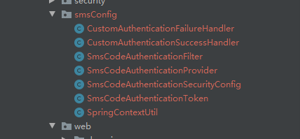
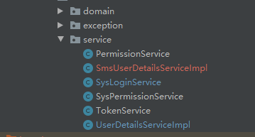
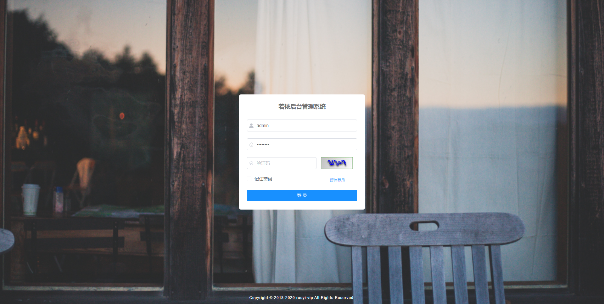
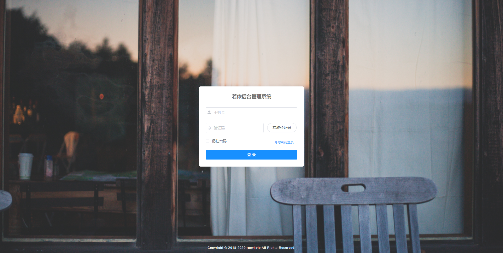

# RuoYi-Vue-SmsLogin
## 若依分离版短信登录
主要依照springSecurity用户名密码登录的认证流程来重写短信认证流程，不清楚springSecurity的认证流程的先建议熟悉一下springSecurity认证流程，这样对短信认证登录就比较好理解。
这里有个认证流程讲解可以参考参考https://blog.csdn.net/yuanlaijike/article/details/84703690
## 功能速览
重写认证流程主要在ruoyi-framework下面 

熟悉认证流程后再添加一个smsUserDetailService

添加后会出现两个userDetail，一个是用户名登录，一个是短信登录，两个都实现了UserDetailsService，必须在一个上指定@Primary，不然启动时spring会报错。

登录页面

短信暂时采用后台生成随机数字，发送后可在后台查看。
文档不是写的很好，多多谅解哈哈哈
有问题联系qq:644119817
一个大胸弟提供了一份非常详细的说明，在上面，比我说的好万倍，手把手式的，还不会的建议直接打死哈哈哈
